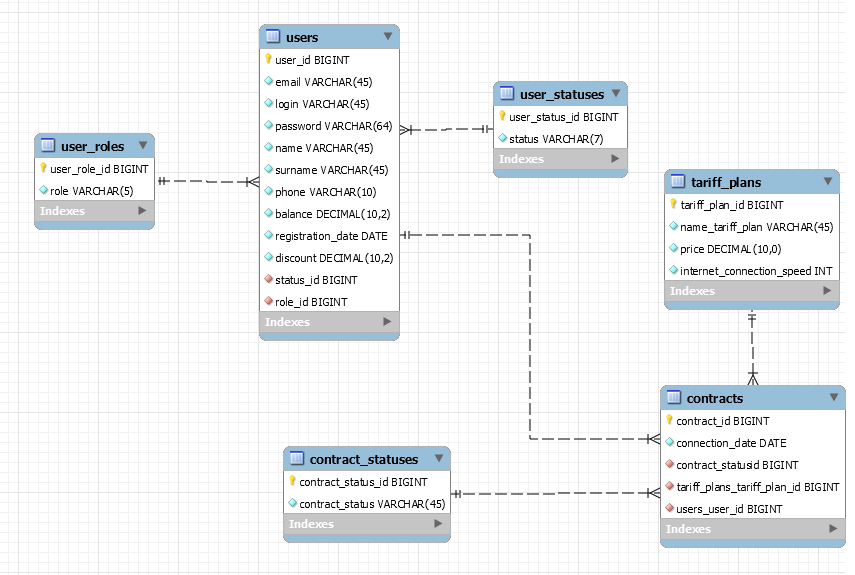

# FinalProject

Final project in Java EPAM course in Minsk, Belarus.

# Internet Service provider

The system allows you to keep track of customers, user balance, list of tariffs, manage users and tariffs.Also, the system records all actions performed under the user agreement and financial transactions. There are 2 types of roles in the system: User, Administrator.

### Unauthorized user
- Authenticate with a login and password
- Registration
- Change locale
### User role
- Go to the home page
- View profile information
- View balance information
- View list of tariffs, which can be connected
- View list of connected tariffs
- Connect tariff
- Disconnect tariff
- Top up balance
- Change information about user(email, name, surname, phone)
- Delete profile
- Restore profile
- Sign out
### Admin role
- Add tariff
- View tariffs
- Change tariff(name if tariff, price, speed)
- Find tariff(name if tariff, price, speed)
- View users
- Find and sort users by parameters(status, id, login, name, surname, email, phone)
- Update user discount
- Block users
- take out money
- View contracts
- Find and sort contracts by parameters(contract id, tariff id, user id)
- Sign out

## Database structure

